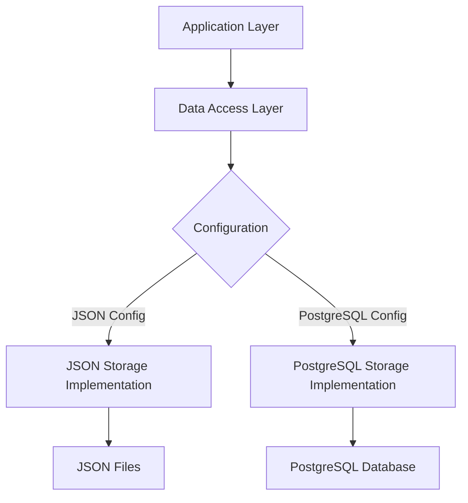

# Design Document: PostgreSQL Upgrade

## Overview

This design document outlines the approach for migrating the application's data storage from JSON files to PostgreSQL. The current application uses JSON files for storing users, messages, and sessions, which works well for development and small deployments but lacks the robustness, scalability, and query capabilities of a proper database system. This upgrade will maintain all existing functionality while providing a more solid foundation for future growth.

## Architecture

The upgraded system will follow a layered architecture pattern:

1. **Application Layer** - Contains the business logic and route handlers (unchanged)
2. **Data Access Layer** - New abstraction layer that will handle database operations
3. **Storage Implementation Layer** - Contains both JSON and PostgreSQL implementations
4. **Configuration Layer** - Determines which storage implementation to use

This architecture allows for:
- Clean separation of concerns
- Easy switching between storage implementations
- Minimal changes to existing application code
- Future extensibility for other database systems

### High-Level Architecture Diagram



## Components and Interfaces

### 1. Database Configuration

A new configuration component will be added to handle database connection settings:

```d
struct DatabaseConfig {
    bool useDatabase;
    string dbType;  // "json" or "postgresql"
    string host;
    int port;
    string dbName;
    string username;
    string password;
    int poolSize;
    int connectionTimeout;
}

DatabaseConfig loadDatabaseConfig() {
    // Load from environment variables or config file
}
```

### 2. Data Access Interface

We'll create interfaces for each data type to abstract the storage implementation:

```d
interface IUserRepository {
    User[] getAllUsers();
    User* findUserByUsername(string username);
    User* findUserByEmail(string email);
    bool createUser(string username, string email, string password);
    void saveAllUsers(User[] users);
}

interface IMessageRepository {
    ContactMessage[] getAllMessages();
    void saveMessage(string name, string email, string message);
    long getMessageCount();
}

interface ISessionRepository {
    UserSession[] getAllSessions();
    string createSession(string userId);
    void deleteSession(string sessionId);
    User* getUserFromSession(string sessionId);
}
```

### 3. JSON Implementation (Existing Code Refactored)

The existing JSON storage code will be refactored into classes that implement the interfaces:

```d
class JSONUserRepository : IUserRepository {
    // Implementation using existing JSON code
}

class JSONMessageRepository : IMessageRepository {
    // Implementation using existing JSON code
}

class JSONSessionRepository : ISessionRepository {
    // Implementation using existing JSON code
}
```

### 4. PostgreSQL Implementation

New classes will be created to implement the interfaces using PostgreSQL:

```d
class PostgreSQLUserRepository : IUserRepository {
    private PostgreSQL db;
    
    this(PostgreSQL db) {
        this.db = db;
    }
    
    // Implementation using PostgreSQL
}

// Similar classes for messages and sessions
```

### 5. Repository Factory

A factory pattern will be used to create the appropriate repository based on configuration:

```d
class RepositoryFactory {
    private DatabaseConfig config;
    private PostgreSQL db;
    
    this(DatabaseConfig config) {
        this.config = config;
        if (config.useDatabase && config.dbType == "postgresql") {
            this.db = new PostgreSQL(config);
        }
    }
    
    IUserRepository createUserRepository() {
        if (config.useDatabase && config.dbType == "postgresql") {
            return new PostgreSQLUserRepository(db);
        } else {
            return new JSONUserRepository();
        }
    }
    
    // Similar methods for message and session repositories
}
```

## Data Models

The existing data models will remain unchanged to maintain compatibility:

```d
struct User {
    string id;
    string username;
    string email;
    string passwordHash;
    SysTime createdAt;
    bool isActive;
}

struct ContactMessage {
    int id;
    string name;
    string email;
    string message;
    SysTime timestamp;
    string userId;
}

struct UserSession {
    string sessionId;
    string userId;
    SysTime createdAt;
    SysTime expiresAt;
}
```

### Database Schema

The PostgreSQL schema will mirror the existing data structures:

```sql
CREATE TABLE IF NOT EXISTS users (
    id VARCHAR(36) PRIMARY KEY,
    username VARCHAR(100) UNIQUE NOT NULL,
    email VARCHAR(255) UNIQUE NOT NULL,
    password_hash TEXT NOT NULL,
    created_at TIMESTAMP NOT NULL,
    is_active BOOLEAN NOT NULL DEFAULT TRUE
);

CREATE TABLE IF NOT EXISTS messages (
    id SERIAL PRIMARY KEY,
    name VARCHAR(100) NOT NULL,
    email VARCHAR(255) NOT NULL,
    message TEXT NOT NULL,
    timestamp TIMESTAMP NOT NULL,
    user_id VARCHAR(36) NULL REFERENCES users(id)
);

CREATE TABLE IF NOT EXISTS sessions (
    session_id VARCHAR(36) PRIMARY KEY,
    user_id VARCHAR(36) NOT NULL REFERENCES users(id),
    created_at TIMESTAMP NOT NULL,
    expires_at TIMESTAMP NOT NULL
);

-- Indexes for performance
CREATE INDEX IF NOT EXISTS idx_users_username ON users(username);
CREATE INDEX IF NOT EXISTS idx_users_email ON users(email);
CREATE INDEX IF NOT EXISTS idx_messages_timestamp ON messages(timestamp);
CREATE INDEX IF NOT EXISTS idx_sessions_expires_at ON sessions(expires_at);
```

## Database Connection Management

The PostgreSQL connection will be managed using Vibe.d's built-in database support:

```d
class PostgreSQL {
    private DatabaseConfig config;
    private ConnectionPool pool;
    
    this(DatabaseConfig config) {
        this.config = config;
        this.pool = new ConnectionPool(
            config.poolSize,
            () => connectToDB(config)
        );
    }
    
    private Connection connectToDB(DatabaseConfig config) {
        // Connect to PostgreSQL using config
    }
    
    Connection getConnection() {
        return pool.getConnection();
    }
    
    void executeQuery(string sql, ParameterBinding[] params) {
        // Execute query with proper error handling
    }
    
    // Other database operations
}
```

## Migration Utility

A migration utility will be created to transfer data from JSON to PostgreSQL:

```d
class DataMigrator {
    private IUserRepository sourceRepo;
    private IUserRepository targetRepo;
    private IMessageRepository sourceMessageRepo;
    private IMessageRepository targetMessageRepo;
    private ISessionRepository sourceSessionRepo;
    private ISessionRepository targetSessionRepo;
    
    // Constructor and migration methods
    
    bool migrateAll() {
        try {
            migrateUsers();
            migrateMessages();
            migrateSessions();
            return true;
        } catch (Exception e) {
            // Log error and return false
            return false;
        }
    }
    
    // Individual migration methods
}
```

## Error Handling

The PostgreSQL implementation will include robust error handling:

1. **Connection Errors** - Attempt reconnection with exponential backoff
2. **Query Errors** - Log detailed error information and return appropriate error responses
3. **Migration Errors** - Roll back changes if possible and maintain data integrity
4. **Fallback Mechanism** - Switch to JSON storage if database is unavailable

## Testing Strategy

The testing strategy will include:

1. **Unit Tests**
   - Test each repository implementation independently
   - Verify correct data mapping between models and database
   - Test error handling and edge cases

2. **Integration Tests**
   - Test the complete data flow from application to database
   - Verify data persistence across application restarts
   - Test migration utility with various data scenarios

3. **Performance Tests**
   - Compare performance between JSON and PostgreSQL implementations
   - Test with larger datasets to verify scalability
   - Identify and optimize any performance bottlenecks

4. **Failover Tests**
   - Test fallback to JSON when database is unavailable
   - Test reconnection when database becomes available again

## Deployment Considerations

1. **Environment Variables**
   - `DB_TYPE`: "json" or "postgresql"
   - `DB_HOST`: Database host address
   - `DB_PORT`: Database port
   - `DB_NAME`: Database name
   - `DB_USER`: Database username
   - `DB_PASSWORD`: Database password
   - `DB_POOL_SIZE`: Connection pool size

2. **Docker Compose Updates**
   - Add PostgreSQL service
   - Configure environment variables
   - Set up volume for persistent storage

3. **Migration Process**
   - Document step-by-step migration process
   - Provide rollback instructions
   - Include data verification steps